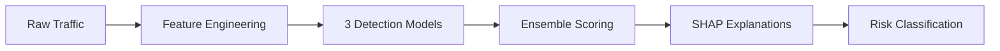

# 🛡️ DriftGuard - Project Overview

> **Advanced Network Intrusion Detection System with Cross-Dataset Validation**

---

## 🎯 What is DriftGuard?

**DriftGuard** is an ensemble machine learning system that detects network anomalies and adapts to dataset shifts. It combines three complementary detection models with explainable AI to provide robust intrusion detection across diverse network environments.

### The Problem We Solve

Traditional intrusion detection systems fail when deployed in environments different from where they were trained:

- ❌ A model trained on university traffic produces thousands of false alerts in corporate networks
- ❌ 95% accuracy in lab → 60% accuracy in production
- ❌ Security teams lose trust in automated systems
- ❌ Alert fatigue prevents analysts from catching real threats

### Our Solution

✅ **Ensemble of three models** for complementary detection  
✅ **Cross-dataset validation** (CICIDS2017 → UNSW-NB15)  
✅ **Distribution shift analysis** using KS tests and PSI  
✅ **Explainable predictions** with SHAP values  
✅ **Production-ready** modular architecture  

---

## 🤖 Three Detection Engines

DriftGuard combines three complementary approaches to anomaly detection:

### 1. 🌲 Isolation Forest (Weight: 30%)
- Tree-based outlier detection
- Isolates anomalies based on feature randomness
- Fast training and inference
- Effective for high-dimensional network traffic data

### 2. 🧠 Autoencoder (Weight: 40%)
- Dense neural network: 77 → 50 → 25 → 50 → 77
- Learns normal traffic patterns through reconstruction
- Flags anomalies based on MSE (Mean Squared Error)
- Trained on benign traffic only

### 3. ⏱️ LSTM Autoencoder (Weight: 30%)
- Bidirectional LSTM for temporal dependencies
- Analyzes 10-timestep windows
- Captures sequence-based anomalies
- Detects time-series patterns in network flows

---

## ⚙️ How It Works

### Workflow Pipeline



### Step-by-Step Process

**1. Data Preprocessing**
- Load network traffic (CICIDS2017 or UNSW-NB15)
- Extract 77 network features
- Clean data (remove NaN, infinity values)
- Scale features using StandardScaler
- Save as `.npy` files for efficient loading

**2. Model Training**
- Train all three models on **benign traffic only**
- Models learn what "normal" looks like
- Save trained models: `iforest_model.pkl`, `autoencoder.keras`, `lstm_autoencoder.keras`

**3. Ensemble Scoring**
- Normalize model outputs to [0, 1] range
- Apply weighted fusion: `0.3×IF + 0.4×AE + 0.3×LSTM`
- Generate unified risk score
- Classify severity: HIGH (≥0.7), MEDIUM (≥0.4), LOW (<0.4)

**4. Explainability**
- Use SHAP values to explain predictions
- Generate waterfall plots showing feature contributions
- Help analysts understand *why* traffic was flagged

**5. Cross-Dataset Validation**
- Align UNSW-NB15 features to CICIDS2017 feature space
- Apply trained models to new dataset
- Measure performance degradation
- Analyze distribution shifts using statistical tests

---

## ✨ Key Features

| Feature | Description |
|---------|-------------|
| 🔄 **Cross-Dataset Generalization** | Validated on UNSW-NB15 after training on CICIDS2017 |
| 🎯 **Ensemble Fusion** | Weighted combination of three complementary models |
| 📊 **Distribution Analysis** | KS tests and PSI to quantify dataset drift |
| 🔍 **SHAP Explanations** | Feature-level interpretability for every prediction |
| ⚡ **Fast Inference** | ~2,380 samples/sec, 420ms per 1000 samples |
| 🪶 **Lightweight** | Only 3MB total model size for easy deployment |

---

## 🛠️ Technology Stack

### Core Libraries
- **Data Processing**: pandas, numpy, scipy
- **Machine Learning**: scikit-learn
- **Deep Learning**: tensorflow, keras
- **Visualization**: matplotlib, seaborn, plotly
- **Explainability**: shap
- **Model Persistence**: joblib
- **Dashboard**: streamlit

### Development Tools
- **Jupyter** - Interactive notebooks
- **pytest** - Unit testing
- **Git LFS** - Large file storage

---

## 📈 Project Statistics

| Metric | Value |
|--------|-------|
| **Network Features** | 77 |
| **Detection Models** | 3 |
| **Datasets Validated** | 2 (CICIDS2017, UNSW-NB15) |
| **Training Time** | ~65 minutes |
| **Model Size** | 3 MB total |
| **Throughput** | 2,380 samples/second |
| **Memory Usage** | ~4 GB RAM |

---

## 🎯 Use Cases

### 🏢 Security Operations Centers (SOC)
Reduce alert fatigue with ensemble scoring and SHAP explanations that help analysts prioritize real threats over false positives.

### 🔬 Research & Academia
Study cross-dataset generalization, dataset shift quantification, and ensemble methods for anomaly detection in cybersecurity.

### 🏭 Enterprise Networks
Deploy models trained on public datasets (CICIDS2017) to private networks with confidence in cross-environment performance.

---

## 📁 Project Structure

```
DriftGuard/
├── notebooks/              # Jupyter notebooks (data exploration, training, evaluation)
├── research/               # Research experiments and analysis
│   ├── experiments/        # Model comparison, false positive analysis
│   └── results/            # Figures and experimental results
├── src/                    # Production code modules
│   ├── data_loader.py      # Data loading utilities
│   ├── features.py         # Feature engineering
│   ├── train_iforest.py    # Isolation Forest training
│   ├── train_autoencoder.py # Autoencoder training
│   ├── train_lstm.py       # LSTM training
│   ├── risk_scoring.py     # Ensemble fusion
│   └── inference.py        # End-to-end detection
├── docs/                   # Comprehensive documentation
├── data/                   # Datasets (CICIDS2017, UNSW-NB15)
├── models/                 # Trained models (.pkl, .keras)
└── dashboard/              # Streamlit visualization app
```

---

## 🚀 Quick Start

### 1. Setup Environment

```bash
# Clone repository
git clone <repository-url>
cd await

# Create virtual environment
python -m venv .venv

# Activate virtual environment
.venv\Scripts\activate  # Windows
source .venv/bin/activate  # macOS/Linux

# Install dependencies
pip install -r requirements.txt
```

### 2. Train Models

```bash
# Option A: Use Jupyter notebooks
jupyter notebook notebooks/01_data_exploration.ipynb

# Option B: Use Python scripts
python src/train_iforest.py
python src/train_autoencoder.py
python src/train_lstm.py
```

### 3. Make Predictions

```python
from src.inference import AnomalyDetector

# Initialize detector
detector = AnomalyDetector()

# Load trained models
detector.load_model('iforest', 'models/iforest_model.pkl', 'sklearn')
detector.load_model('autoencoder', 'models/autoencoder.keras', 'keras')
detector.load_model('lstm', 'models/lstm_autoencoder.keras', 'keras')

# Predict on new traffic
predictions = detector.predict(X_test)
risk_scores = detector.get_risk_scores(X_test)
```

### 4. View Explanations

```bash
# Run SHAP explainability notebook
jupyter notebook notebooks/07_explainability_shap.ipynb
```

---

## 🔬 Research Contributions

### Academic Contributions
1. **Quantitative Cross-Dataset Analysis**: First comprehensive KS/PSI analysis between CICIDS2017 and UNSW-NB15
2. **Ensemble Architecture for Dataset Shift**: Novel weighted fusion approach demonstrating robustness
3. **Explainability Framework**: SHAP integration for network intrusion detection

### Practical Contributions
1. **Production-Ready System**: Modular, scalable codebase
2. **Interactive Dashboard**: Streamlit-based visualization for SOC teams
3. **Open-Source Implementation**: Complete code with reproducible experiments

---

## 🚀 Future Enhancements

### 🔮 Zeek Real-Time Inference (Linux)
- Integration with Zeek network security monitor
- Live traffic analysis and streaming predictions
- Real-time anomaly detection in production environments

### 🗺️ MITRE ATT&CK Auto-Mapping
- Automatic attack technique classification
- Mapping detected anomalies to MITRE ATT&CK tactics
- Enhanced threat intelligence and incident response

> [!NOTE]
> These features are in planning phase and require Linux deployment environment.

---

## 📚 Documentation

| Document | Description |
|----------|-------------|
| [00_INDEX.md](docs/00_INDEX.md) | Documentation index |
| [01_INTRODUCTION.md](docs/01_INTRODUCTION.md) | Problem statement and research questions |
| [02_ARCHITECTURE.md](docs/02_ARCHITECTURE.md) | System architecture and design |
| [03_DATASETS.md](docs/03_DATASETS.md) | Dataset descriptions and preprocessing |
| [04_METHODOLOGY.md](docs/04_METHODOLOGY.md) | Research methodology |
| [05_IMPLEMENTATION.md](docs/05_IMPLEMENTATION.md) | Code structure and modules |
| [06_MODELS.md](docs/06_MODELS.md) | Model architectures and training |
| [07_EXPERIMENTS.md](docs/07_EXPERIMENTS.md) | Experimental results |
| [08_CROSS_DATASET_VALIDATION.md](docs/08_CROSS_DATASET_VALIDATION.md) | UNSW-NB15 validation |
| [09_EXPLAINABILITY.md](docs/09_EXPLAINABILITY.md) | SHAP interpretability |
| [11_DEPLOYMENT.md](docs/11_DEPLOYMENT.md) | Deployment guide |

---

## 📝 License

This project is licensed under the MIT License.

---

## 🔗 Quick Links

- 📚 [Full Documentation](docs/00_INDEX.md)
- 📖 [README](README.md)
- 🔬 [Research Notes](research/notes.md)
- 📊 [Notebooks](notebooks/)
- 💻 [Source Code](src/)

---

**Built with ❤️ for robust, explainable network intrusion detection**
