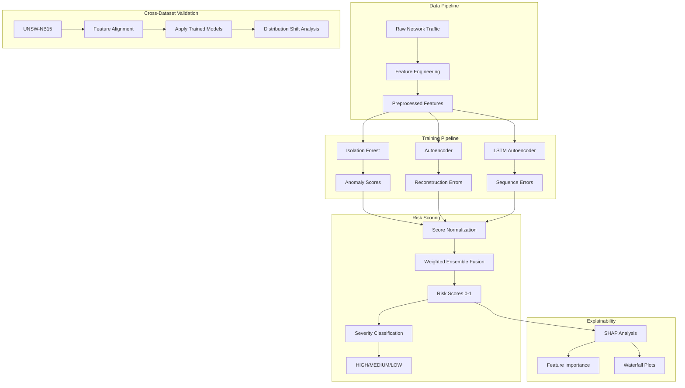
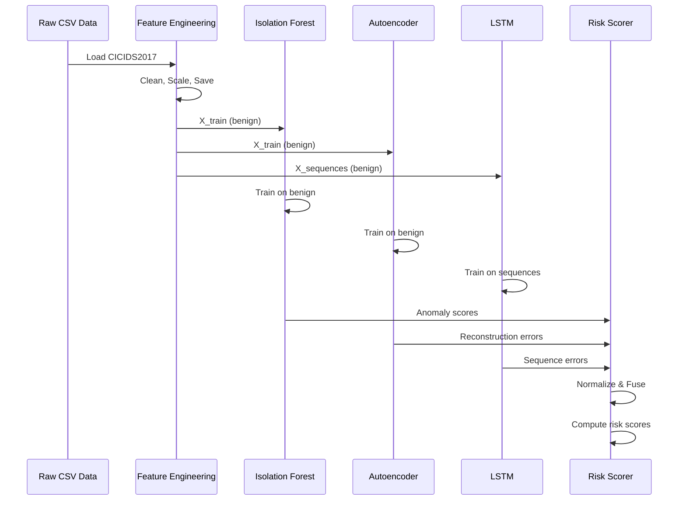
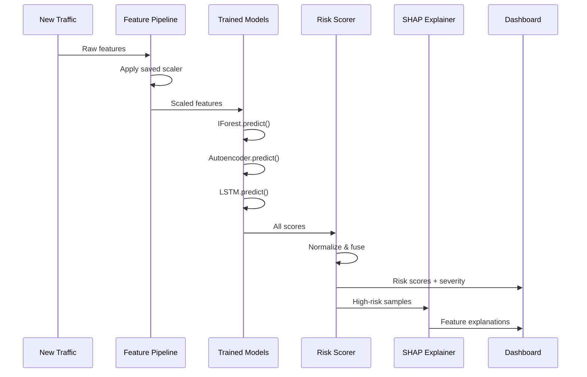
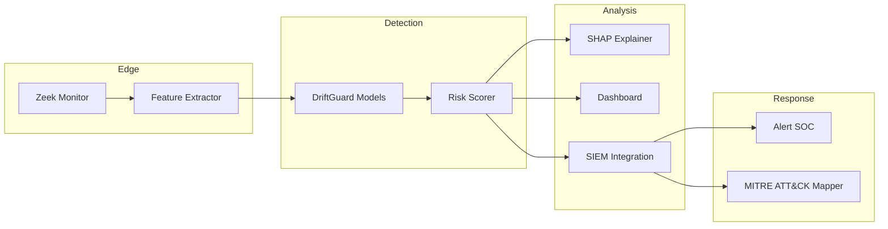

# System Architecture

**[← Previous: Introduction](01_INTRODUCTION.md)** | **[Back to Index](00_INDEX.md)** | **[Next: Datasets →](03_DATASETS.md)**

---

## Architecture Overview

DriftGuard follows a modular, pipeline-based architecture designed for scalability, maintainability, and cross-dataset robustness.



---

## Core Components

| Component | Purpose | File Location | Key Responsibilities |
|-----------|---------|---------------|----------------------|
| **Data Loader** | Centralized data loading | `src/data_loader.py` | Load datasets, models, artifacts |
| **Feature Engineering** | Transform raw traffic | `src/features.py` | Scaling, preprocessing, sequences |
| **Isolation Forest** | Tree-based detection | `src/train_iforest.py` | Train IForest, generate scores |
| **Autoencoder** | Reconstruction detection | `src/train_autoencoder.py` | Train dense AE, compute errors |
| **LSTM Autoencoder** | Temporal detection | `src/train_lstm.py` | Train LSTM, sequence errors |
| **Risk Scoring** | Ensemble fusion | `src/risk_scoring.py` | Normalize, fuse, classify severity |
| **Inference** | Production predictions | `src/inference.py` | End-to-end detection pipeline |
| **Explainability** | Model interpretation | Notebooks + SHAP | Feature importance, waterfall |
| **Visualization** | Plotting utilities | `src/plot_utils.py` | Save plots, dashboard |
| **Dashboard** | Interactive UI | `dashboard/app.py` | Streamlit monitoring |

---

## Detailed Component Architecture

### 1. Data Pipeline

#### Input
- **CICIDS2017 CSV files** (raw network traffic)
- **UNSW-NB15 CSV files** (validation dataset)

#### Processing Steps
1. **Load** raw CSV files
2. **Clean** infinite values, NaNs
3. **Extract** features and labels
4. **Scale** using StandardScaler
5. **Save** preprocessed `.npy` files

#### Output
- `X_phase2.npy` - Feature matrix (77 features)
- `y_phase2.npy` - Labels (0=benign, 1=attack)

### 2. Training Pipeline

#### Isolation Forest Module
```
Input: X_train (benign traffic only)
Process: Build isolation trees
Output: iforest_scores.npy
Model: isolation_forest.pkl (1.8 MB)
```

#### Autoencoder Module
```
Input: X_train (benign traffic only)
Architecture: 77 → 50 → 25 → 50 → 77
Loss: MSE (reconstruction error)
Output: autoencoder_errors.npy
Model: autoencoder.keras (200 KB)
```

#### LSTM Module
```
Input: X_sequences (10 timesteps)
Architecture: Bidirectional LSTM → Encoder → Decoder
Loss: MSE (sequence prediction error)
Output: lstm_sequence_errors.npy
Model: lstm_autoencoder.keras (936 KB)
```

### 3. Risk Scoring Pipeline

#### Score Normalization
```python
# Each model outputs different scales
iforest_scores: [-0.5, -0.1]  # Negative values
autoencoder_errors: [0.01, 2.5]  # Positive MSE
lstm_errors: [0.05, 3.2]  # Positive MSE

# Normalize all to [0, 1]
normalized = (score - min) / (max - min)
# Higher = more anomalous
```

#### Weighted Fusion
```python
# Default ensemble weights
weights = {
    'iforest': 0.3,
    'autoencoder': 0.4,  # Highest weight
    'lstm': 0.3
}

# Fused risk score
risk_score = (w_if * norm_if + 
              w_ae * norm_ae + 
              w_lstm * norm_lstm)
```

#### Severity Classification
```python
if risk_score >= 0.7:
    severity = "HIGH"
elif risk_score >= 0.4:
    severity = "MEDIUM"
else:
    severity = "LOW"
```

### 4. Explainability Pipeline

#### SHAP Integration
```
Model: Isolation Forest (TreeExplainer)
Input: Flagged samples
Process: Compute SHAP values
Output: Feature contribution per prediction
Visualization: Waterfall plots, summary plots
```

### 5. Cross-Dataset Validation Pipeline

#### Feature Alignment
```
CICIDS2017 features (77) → Canonical feature set
UNSW-NB15 features (49) → Map to 77-feature space
Missing features → Zero-padding
Extra features → Ignored
Scaler: Use CICIDS2017 mean/std
```

#### Distribution Analysis
```
Statistical Tests:
- Kolmogorov-Smirnov (KS) test
- Population Stability Index (PSI)

Output:
- KS statistics per feature
- PSI values per feature
- Shift severity classification
```

---

## System Flow Diagrams

### Training Flow



### Inference Flow



---

## Technology Stack

### Core Libraries

| Category | Libraries | Purpose |
|----------|-----------|---------|
| **Data Processing** | pandas, numpy, scipy | DataFrames, arrays, statistics |
| **Machine Learning** | scikit-learn | Isolation Forest, preprocessing |
| **Deep Learning** | tensorflow, keras | Autoencoder, LSTM models |
| **Visualization** | matplotlib, seaborn, plotly | Plots, charts, dashboards |
| **Explainability** | shap | Feature importance, waterfall |
| **Utilities** | joblib, tqdm | Model persistence, progress bars |
| **Dashboard** | streamlit | Interactive web interface |

### Development Tools

| Tool | Purpose |
|------|---------|
| **Jupyter** | Interactive notebooks |
| **pytest** | Unit testing |
| **black** | Code formatting |
| **flake8** | Linting |
| **Git LFS** | Large file storage |

---

## Design Principles

### 1. Modularity
Each component is self-contained:
- `data_loader.py` handles ALL data loading
- `risk_scoring.py` handles ALL scoring logic
- No circular dependencies

### 2. Separation of Concerns
```
Training (src/train_*.py) ≠ Inference (src/inference.py)
Models (models/) ≠ Data (data/)
Notebooks (notebooks/) ≠ Production Code (src/)
```

### 3. Reproducibility
- Fixed random seeds (`random_state=42`)
- Saved preprocessing artifacts (scalers, normalizers)
- Version-controlled models (Git LFS)

### 4. Scalability
- Batch processing support
- Model serving ready (TensorFlow/Keras)
- Distributed processing compatible

### 5. Interpretability
- SHAP integration from day one
- Risk score explanations
- Feature contribution tracking

---

## Deployment Architecture (Future)



---

## Performance Characteristics

| Metric | Value | Notes |
|--------|-------|-------|
| **Training Time** | ~65 minutes | All 3 models on CICIDS2017 |
| **Inference Time** | 420ms per 1000 samples | Ensemble (sequential) |
| **Model Size** | 3 MB total | Lightweight for deployment |
| **Memory Usage** | ~4 GB RAM | Training on 2M samples |
| **Throughput** | ~2,380 samples/sec | Single-threaded |

---

## Security Considerations

1. **Model Poisoning**: Train only on verified benign traffic
2. **Adversarial Attacks**: Not yet addressed (future work)
3. **Data Privacy**: Models learn patterns, not raw packets
4. **Access Control**: Separate training and production environments

---

**Next: [Datasets →](03_DATASETS.md)**

**[← Previous: Introduction](01_INTRODUCTION.md) | [Back to Index](00_INDEX.md)**
