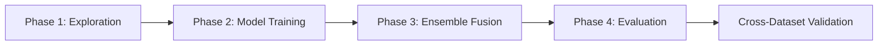

# Methodology

**[← Previous: Datasets](03_DATASETS.md)** | **[Back to Index](00_INDEX.md)** | **[Next: Implementation →](05_IMPLEMENTATION.md)**

---

## Research Methodology Overview

DriftGuard follows a **4-phase iterative methodology** for developing a robust cross-dataset intrusion detection system.



---

## Phase 1: Data Exploration & Feature Engineering

**Objective**: Understand data characteristics and prepare features for modeling

**Files**: 
- `notebooks/01_data_exploration.ipynb`
- `notebooks/02_feature_engineering.ipynb`

### Step 1.1: Exploratory Data Analysis

```python
import pandas as pd
import numpy as np
import matplotlib.pyplot as plt
import seaborn as sns

# Load CICIDS2017 data
df = pd.read_csv('data/CICIDS2017/Monday-WorkingHours.pcap_ISCX.csv')

# Statistical summaries
print(df.describe())
print(df.info())

# Class distribution
print(df[' Label'].value_counts())

# Feature correlations
correlation_matrix = df.corr()
plt.figure(figsize=(20, 16))
sns.heatmap(correlation_matrix, cmap='coolwarm')
```

**Key Findings**:
- ✅ High class imbalance (~95% benign traffic)
- ✅ Strong correlations among packet-based features
- ✅ Presence of extreme outliers requiring robust scaling
- ⚠️ Infinite values in flow rate features
- ⚠️ Missing values in some samples

### Step 1.2: Feature Engineering

**Feature Selection Criteria**:
1. Variance threshold (remove constant features)
2. Correlation analysis (remove redundant features)
3. Domain knowledge (keep security-relevant features)

```python
from sklearn.feature_selection import VarianceThreshold
from sklearn.preprocessing import StandardScaler

# Remove low-variance features
selector = VarianceThreshold(threshold=0.01)
X_selected = selector.fit_transform(X)

# Final feature set: 77 features
feature_names = df.columns[selector.get_support()]
```

### Step 1.3: Data Preprocessing

```python
# 1. Handle infinite values
X = X.replace([np.inf, -np.inf], np.nan)

# 2. Remove NaN rows
X = X.dropna()

# 3. Separate features and labels
y = (df[' Label'] != 'BENIGN').astype(int)

# 4. Train/test split
from sklearn.model_selection import train_test_split
X_train, X_test, y_train, y_test = train_test_split(
    X, y, test_size=0.2, stratify=y, random_state=42
)

# 5. Scale features
scaler = StandardScaler()
X_train_scaled = scaler.fit_transform(X_train)
X_test_scaled = scaler.transform(X_test)

# 6. Extract benign samples for unsupervised training
X_benign = X_train_scaled[y_train == 0]
```

---

## Phase 2: Model Training

**Objective**: Train three complementary anomaly detection models

### 2.1 Isolation Forest Training

**File**: `notebooks/03_isolation_forest.ipynb`, `src/train_iforest.py`

**Approach**: Unsupervised anomaly detection via isolation

```python
from sklearn.ensemble import IsolationForest

# Train on benign traffic only
model = IsolationForest(
    n_estimators=100,
    contamination=0.1,
    max_samples=256,
    random_state=42
)
model.fit(X_benign)

# Generate anomaly scores
scores = model.decision_function(X_test_scaled)

# Save model
import joblib
joblib.dump(model, 'models/isolation_forest.pkl')
```

**Hyperparameter Tuning**:
- Grid search over `n_estimators`: [50, 100, 200]
- Contamination: [0.05, 0.1, 0.15]
- Best params: `n_estimators=100, contamination=0.1`

### 2.2 Autoencoder Training

**File**: `notebooks/04_autoencoder.ipynb`, `src/train_autoencoder.py`

**Approach**: Reconstruction-based anomaly detection

```python
from tensorflow import keras

# Build autoencoder
input_dim = 77
autoencoder = keras.Sequential([
    keras.layers.Dense(50, activation='relu', input_shape=(input_dim,)),
    keras.layers.Dense(25, activation='relu'),  # Bottleneck
    keras.layers.Dense(50, activation='relu'),
    keras.layers.Dense(input_dim, activation='linear')
])

autoencoder.compile(optimizer='adam', loss='mse')

# Train on benign traffic
history = autoencoder.fit(
    X_benign, X_benign,
    epochs=50,
    batch_size=256,
    validation_split=0.2,
    callbacks=[keras.callbacks.EarlyStopping(patience=10)]
)

# Compute reconstruction errors
X_test_reconstructed = autoencoder.predict(X_test_scaled)
reconstruction_errors = np.mean((X_test_scaled - X_test_reconstructed)**2, axis=1)

# Save model
autoencoder.save('models/autoencoder.keras')
```

### 2.3 LSTM Autoencoder Training

**File**: `notebooks/05_lstm_sequence_model.ipynb`, `src/train_lstm.py`

**Approach**: Temporal sequence-based anomaly detection

```python
from tensorflow.keras.preprocessing.sequence import TimeseriesGenerator

# Create sequences (window=10)
def create_sequences(data, window=10):
    X_seq = []
    for i in range(len(data) - window):
        X_seq.append(data[i:i+window])
    return np.array(X_seq)

X_benign_seq = create_sequences(X_benign, window=10)

# Build LSTM autoencoder
lstm_ae = keras.Sequential([
    keras.layers.Bidirectional(
        keras.layers.LSTM(64, return_sequences=True),
        input_shape=(10, 77)
    ),
    keras.layers.LSTM(32),
    keras.layers.RepeatVector(10),
    keras.layers.LSTM(32, return_sequences=True),
    keras.layers.LSTM(64, return_sequences=True),
    keras.layers.TimeDistributed(keras.layers.Dense(77))
])

lstm_ae.compile(optimizer='adam', loss='mse')

# Train
lstm_ae.fit(X_benign_seq, X_benign_seq, epochs=50, batch_size=128)

# Save
lstm_ae.save('models/lstm_autoencoder.keras')
```

---

## Phase 3: Ensemble Risk Scoring

**Objective**: Fuse model outputs into unified risk scores

**File**: `src/risk_scoring.py`

### 3.1 Score Normalization

Each model outputs different scales:

```python
# Isolation Forest: [-0.5, -0.1] (negative)
# Autoencoder: [0.01, 2.5] (MSE)
# LSTM: [0.05, 3.2] (MSE)

# Normalize all to [0, 1]
from sklearn.preprocessing import MinMaxScaler

scaler_if = MinMaxScaler()
norm_if = scaler_if.fit_transform(iforest_scores.reshape(-1, 1))

scaler_ae = MinMaxScaler()
norm_ae = scaler_ae.fit_transform(ae_errors.reshape(-1, 1))

scaler_lstm = MinMaxScaler()
norm_lstm = scaler_lstm.fit_transform(lstm_errors.reshape(-1, 1))
```

### 3.2 Weighted Ensemble Fusion

```python
# Define weights (sum to 1.0)
weights = {
    'iforest': 0.3,
    'autoencoder': 0.4,  # Highest weight
    'lstm': 0.3
}

# Fused risk score
risk_scores = (
    weights['iforest'] * norm_if +
    weights['autoencoder'] * norm_ae +
    weights['lstm'] * norm_lstm
)
```

**Weight Selection Rationale**:
- Autoencoder: 0.4 (best individual performance)
- Isolation Forest: 0.3 (fast, interpretable)
- LSTM: 0.3 (temporal patterns)

### 3.3 Severity Classification

```python
def assign_severity(risk_score):
    if risk_score >= 0.7:
        return "HIGH"
    elif risk_score >= 0.4:
        return "MEDIUM"
    else:
        return "LOW"

severity_labels = np.array([assign_severity(score) for score in risk_scores])
```

---

## Phase 4: Model Evaluation

**Objective**: Comprehensive performance assessment

**File**: `notebooks/06_model_evaluation.ipynb`

### 4.1 Evaluation Metrics

```python
from sklearn.metrics import (
    roc_auc_score,
    precision_recall_fscore_support,
    confusion_matrix,
    classification_report
)

# Binary predictions (threshold=0.7)
y_pred = (risk_scores >= 0.7).astype(int)

# Compute metrics
auc = roc_auc_score(y_test, risk_scores)
precision, recall, f1, _ = precision_recall_fscore_support(
    y_test, y_pred, average='binary'
)

print(f"AUC-ROC: {auc:.3f}")
print(f"Precision: {precision:.3f}")
print(f"Recall: {recall:.3f}")
print(f"F1-Score: {f1:.3f}")

# Confusion matrix
cm = confusion_matrix(y_test, y_pred)
print(cm)
```

### 4.2 ROC Curve Analysis

```python
from sklearn.metrics import roc_curve

fpr, tpr, thresholds = roc_curve(y_test, risk_scores)

plt.figure(figsize=(8, 6))
plt.plot(fpr, tpr, label=f'Ensemble (AUC={auc:.3f})')
plt.plot([0, 1], [0, 1], 'k--', label='Random')
plt.xlabel('False Positive Rate')
plt.ylabel('True Positive Rate')
plt.title('ROC Curve')
plt.legend()
plt.grid(True)
```

### 4.3 Threshold Optimization

```python
# Find optimal threshold using Youden's J statistic
j_scores = tpr - fpr
optimal_idx = np.argmax(j_scores)
optimal_threshold = thresholds[optimal_idx]

print(f"Optimal threshold: {optimal_threshold:.3f}")
print(f"TPR: {tpr[optimal_idx]:.3f}, FPR: {fpr[optimal_idx]:.3f}")
```

---

## Iterative Refinement Process

### Iteration 1: Baseline Models
- Train individual models
- Evaluate on CICIDS2017 test set
- **Result**: Moderate performance, high false positives

### Iteration 2: Hyperparameter Tuning
- Grid search for optimal parameters
- Cross-validation within CICIDS2017
- **Result**: Improved precision

### Iteration 3: Ensemble Development
- Experiment with different fusion strategies
- Test various weight combinations
- **Result**: Best overall performance

### Iteration 4: Cross-Dataset Validation
- Test on UNSW-NB15 without retraining
- Analyze performance degradation
- **Result**: Identified dataset shift impact

---

## Experimental Design Principles

### 1. Reproducibility

```python
# Set random seeds
import random
random.seed(42)
np.random.seed(42)
import tensorflow as tf
tf.random.set_seed(42)
```

### 2. Data Leakage Prevention

✅ Fit scaler on training data only  
✅ Use training statistics for test normalization  
✅ No test data in model training  
✅ Cross-dataset uses source dataset statistics  

### 3. Stratified Sampling

```python
# Maintain class proportions
X_train, X_test, y_train, y_test = train_test_split(
    X, y, test_size=0.2, stratify=y, random_state=42
)
```

### 4. Validation Strategy

- 80/20 train/test split on CICIDS2017
- Cross-validation within training set for hyperparameters
- Final evaluation on held-out test set
- Cross-dataset validation on UNSW-NB15

---

## Statistical Rigor

### Hypothesis Testing

**H0**: Ensemble performs no better than best individual model  
**H1**: Ensemble significantly outperforms individual models  

```python
from scipy.stats import wilcoxon

# Paired Wilcoxon test
ensemble_scores = get_ensemble_scores()
best_individual = get_autoencoder_scores()

statistic, p_value = wilcoxon(ensemble_scores, best_individual)
print(f"p-value: {p_value:.4f}")

if p_value < 0.05:
    print("Ensemble significantly better (p < 0.05)")
```

### Confidence Intervals

```python
from scipy.stats import bootstrap

# 95% confidence interval for AUC
def auc_statistic(y_true, y_pred):
    return roc_auc_score(y_true, y_pred)

ci = bootstrap(
    (y_test, risk_scores),
    auc_statistic,
    n_resamples=1000,
    confidence_level=0.95
)

print(f"AUC: {auc:.3f} (95% CI: [{ci.confidence_interval.low:.3f}, {ci.confidence_interval.high:.3f}])")
```

---

**Next: [Implementation Details →](05_IMPLEMENTATION.md)**

**[← Previous: Datasets](03_DATASETS.md) | [Back to Index](00_INDEX.md)**
